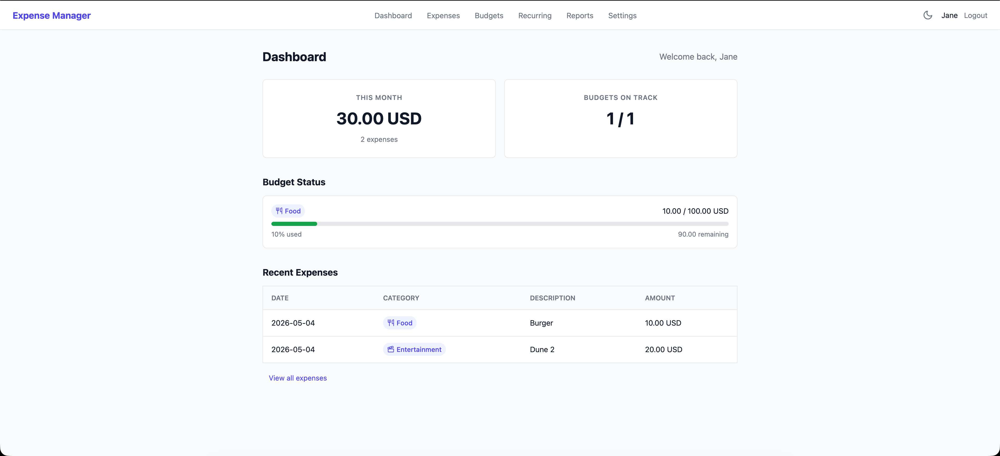
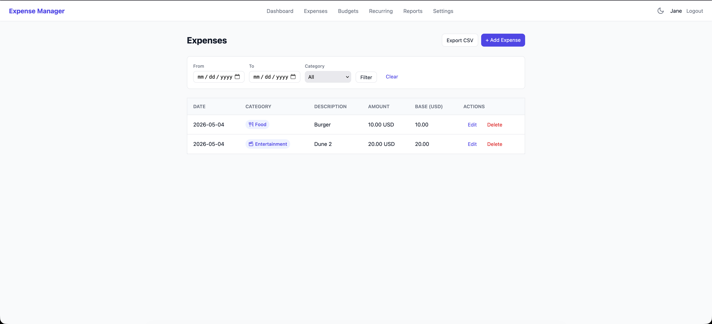
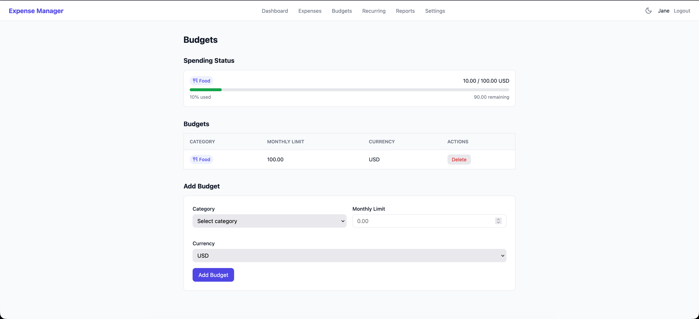
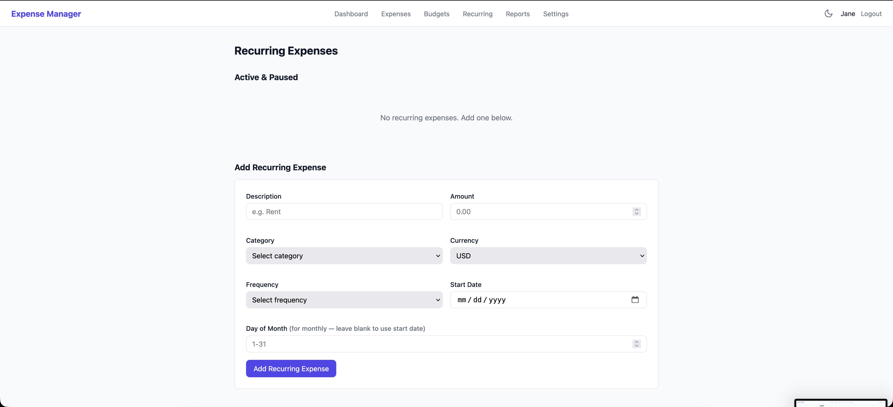
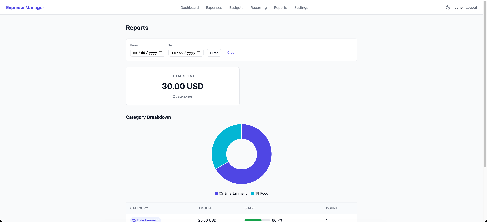
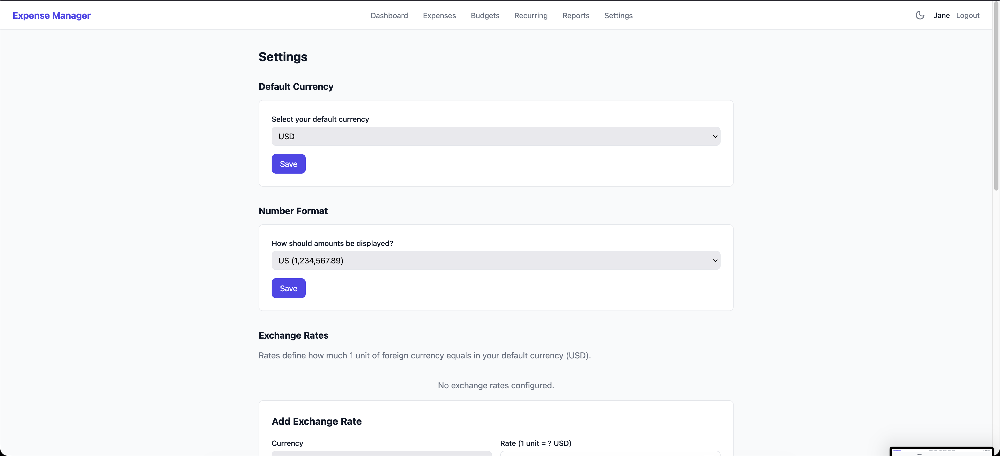

# Expense Manager 
[](https://goreportcard.com/report/github.com/siddhantagarwal/expense-manager)
[](https://opensource.org/licenses/MIT)


A self-hosted, web-based expense tracker built with Go, HTMX, and flat-file JSON storage. Designed for multi-user local deployment with no external database dependencies.

## Quick Start

### Prerequisites

- Go 1.22 or later

### Install & Run

```bash
git clone https://github.com/siddhantagarwal/expense-manager.git
cd expense-manager
go build -o expense-manager ./cmd/server
./expense-manager
```

The binary is fully self-contained — templates and static assets are embedded, so you can deploy just the binary without the `templates/` or `static/` directories.

The server starts on **http://localhost:8080** by default.

### Configuration

| Environment Variable | Default | Description |
|---|---|---|
| `PORT` | `8080` | HTTP server listen port |
| `DATA_DIR` | `data` | Directory for JSON data storage |

```bash
PORT=3000 DATA_DIR=/var/lib/expense-manager ./expense-manager
```

### First Run

1. Open `http://localhost:8080` in your browser
2. Click **Sign Up** to create an account
3. Choose a default currency and set your password
4. Start tracking expenses

---

## Features

### Authentication

- Signup with username and password (bcrypt-hashed)
- Session-based auth with secure, HttpOnly cookies (7-day expiry)
- Per-user data isolation — each user gets their own JSON data file
- Logout clears the session

### Expense Tracking

- Log expenses with amount, currency, category, description, and date
- Filter expenses by date range and category
- Edit or delete any expense
- Inline editing via modal (HTMX-powered, no page reload for edits)
- Amounts auto-converted to your default currency using your exchange rates

### Budgets

- Set a monthly spending limit per category
- Dashboard shows spending vs. budget with color-coded progress bars
- Visual alerts: yellow at 80% usage, red when over budget
- Delete budgets with one click (HTMX, no page reload)

### Reports

- **Category breakdown** — doughnut chart + table showing spending by category
- **Monthly trend** — month-over-month spending comparison table
- **Month-on-month bar chart** — grouped bar chart showing spending by category across all 12 months of the selected year
- **Date range filtering** — filter all reports by custom from/to dates
- All amounts displayed in your default currency
- Powered by Chart.js

### Recurring Expenses

- Create weekly, monthly, or yearly recurring expenses
- Auto-creates expense entries when the next due date arrives (background check every hour)
- Pause or resume recurring expenses at any time
- Delete recurring expenses without affecting already-created entries
- Auto-created expenses are linked to their parent for traceability

### Multi-Currency

- Choose a default currency at signup (USD, EUR, GBP, INR, JPY, CAD, AUD)
- Manually set exchange rates in Settings
- Foreign-currency expenses are auto-converted to your default currency
- Reports always show amounts in your default currency
- No external API calls — fully offline-capable

### Settings

- Change your default currency
- Add, update, or delete exchange rates
- Add or remove custom expense categories
- Change your password (requires current password confirmation)

### Dark Mode

- Toggle between light and dark themes with the moon/sun button in the nav bar
- Preference persists across page loads (stored in localStorage)
- Works on all pages including login/signup

### Responsive Design

- Mobile-friendly layout with responsive breakpoints at 640px
- Tables scroll horizontally on small screens
- Forms stack to single-column on mobile

---

## Screenshots








| Page | Description |
|---|---|
| Dashboard | Overview with monthly total, budget status, and recent expenses |
| Expenses | Filterable expense list with inline edit/delete |
| Budgets | Budget management with spending progress bars |
| Recurring | Manage weekly/monthly/yearly recurring expenses |
| Reports | Category breakdown chart, monthly trend table, and month-on-month bar chart |
| Settings | Currency, exchange rates, categories, password |

---

## Architecture

### Stack

| Layer | Technology |
|---|---|
| Backend | Go (net/http) with gorilla/mux |
| Frontend | Go `html/template` + HTMX + Chart.js |
| Storage | Flat JSON files (one per user) |
| Auth | Session cookies + bcrypt passwords |

### Project Structure

```
expense-manager/
├── cmd/server/main.go          # Entry point, router, graceful shutdown
├── internal/
│   ├── auth/                   # Session management, password hashing
│   ├── embedded/               # go:embed — templates & static bundled in binary
│   │   ├── embed.go
│   │   ├── templates/          # Go HTML templates
│   │   └── static/             # CSS with dark mode support
│   ├── handlers/               # HTTP handlers (one file per domain)
│   │   ├── handlers.go         # Handlers struct, constructor, 404
│   │   ├── auth.go             # Login, signup, logout
│   │   ├── dashboard.go        # Dashboard handler
│   │   ├── expenses.go         # Expense CRUD
│   │   ├── budgets.go          # Budget management
│   │   ├── recurring.go        # Recurring expenses
│   │   ├── reports.go          # Reports
│   │   ├── settings.go         # Settings
│   │   └── validate.go         # Shared validation helpers
│   ├── middleware/             # Auth middleware
│   ├── models/                 # Data structures (User, Expense, etc.)
│   ├── services/               # Business logic (recurring, reports, currency)
│   └── store/                  # JSON file read/write with mutex locking
├── data/                       # JSON storage (gitignored)
│   ├── users.json              # All user accounts
│   └── <username>.json         # Per-user data
├── go.mod
└── go.sum
```

### Data Storage

All data is stored as human-readable JSON files in the `data/` directory:

- `data/users.json` — all user accounts (passwords are bcrypt-hashed)
- `data/<username>.json` — each user's expenses, budgets, recurring expenses, and categories

**Backup:** Copy the `data/` directory. That's it.

**No database required.** The app uses mutex-protected file I/O, so there's no CGO dependency and no external database to install.

### Session Storage

Sessions are stored in memory with a 7-day TTL. Server restarts require re-login. This keeps things simple for local/self-hosted use.

### Recurring Expense Processor

A background goroutine runs on startup and then every hour to check for recurring expenses that are due. When `NextDate <= today`, it auto-creates an expense entry and advances the next date.

---

## Releases

Prebuilt binaries for Linux, macOS, and Windows are available on the [GitHub Releases](https://github.com/siddhantagarwal/expense-manager/releases) page.

### Download a Release

Download the archive for your platform, extract it, and run the binary:

```bash
# Linux / macOS
./expense-manager

# Windows
expense-manager.exe
```

### Install with Go

```bash
go install github.com/siddhantagarwal/expense-manager/cmd/server@latest
```

---

## Development

### Build

```bash
go build -o expense-manager ./cmd/server
```

### Lint

```bash
golangci-lint run
```

The project uses `.golangci.yml` with the following linters: `gocyclo` (min complexity 15), `errcheck`, `gofmt`, `goimports`, `prealloc`, `whitespace`, and others.

### Run in Development

```bash
go run ./cmd/server
```

Changes to Go code, templates, or CSS require a restart (`go run ./cmd/server` recompiles automatically).

---

## License

MIT